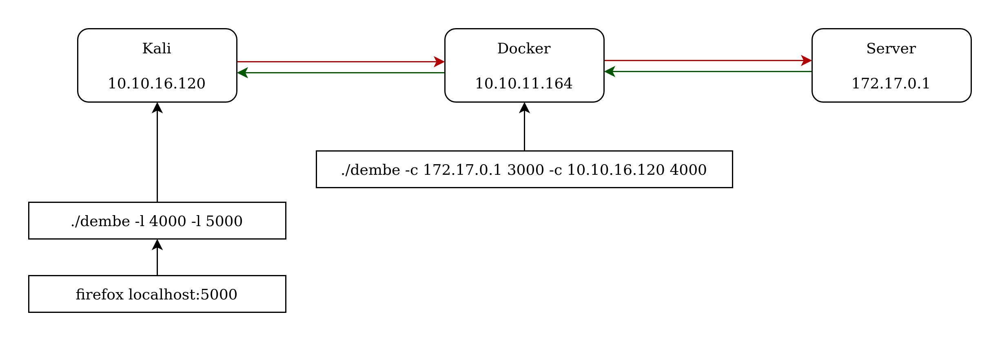

# Dembe
## TCP data transporter: single-file, lightweight and fast

Dembe is a TCP tunnel application written in C. It makes two TCP connections (either via listening or connecting) and sends out the data received from one end to another with its muti-threaded design. It will automatically connect/listen if connection gets terminated.

In this example you can browse the server's HTTP port 3000 from your localhost using `dembe`:


**Using with Firefox**
If you want to browse a web-page throught a tunnel created by `dembe`, then you should change two settings at your Firefox. By default Firefox tries to fetch everything from 6 threads. You should make Firefox to send/receive everything from a single socket. To do that, go to `about:config` in your Firefox and change these:

`network.prefetch-next` -> **false**

`network.http.speculative-parallel-limit` -> **0**

## Usage

```
usage: dembe <mode> [<TCP_IP1>] <PORT1> <mode> [<TCP_IP2>] <PORT2>

mode
   -l	 Listen mode:  It will listen for a port. This mode doesn't require TCP_IP
   -c	 Connect mode: It will connect to given IP:Port

example: ./dembe -l 8080 -c 10.10.10.40 5000
         This will listen on port 8080 and will connect to 10.10.10.40:5000
```

## Compile
It will compile on most UNIX OS family with:

`gcc -lpthread dembe.c -o dembe`

Some systems have `libpthread.a` installed though. In this case you can compile this way:

`gcc -pthread dembe.c -o dembe`

Also if you want to compile static, you can add `-static` to the `gcc` command. The executable filesize will grow but you wouldn't have worry about dependencies. I was able to run static executable on a docker instance.

On Windows, most probably it will be compiled using [cygwin](https://www.cygwin.com/). I don't have Windows to test it; your feedback will be apprecited.

## License
This project is licensed under the MIT License - see the [LICENSE](https://github.com/BloodhoundAllfather/dembe/blob/master/LICENSE) file for details


